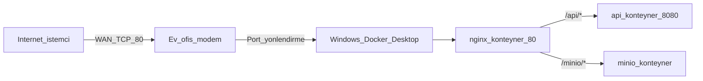

# Docker Desktop (Windows) + WAN erişimi

Bu rehber, **Windows** üzerinde **Docker Desktop** ile [backend/docker-compose.yml](../backend/docker-compose.yml) yığınını çalıştırıp, **ev/ofis modeminde port yönlendirme** ile internetten API’ye ulaşmayı anlatır.

**Stack:** PostgreSQL, RabbitMQ, MinIO, Go API (`api`), **nginx** (tek HTTP girişi **80** → `/api/...` → `api:8080`, `/minio/...` → MinIO **S3**). Mobil veride görseller **80 üzerinden** (`/minio/`) sunulur; böylece birçok operatörün **9000** çıkışını kesmesi engellenir.

İlgili dosyalar: [backend/nginx/default.conf](../backend/nginx/default.conf), [docs/REMOTE_CALISTIRMA.md](REMOTE_CALISTIRMA.md) (genel WAN notları; çoğu Mac örnekli), [backend/README.md](../backend/README.md).

---

## Mimari özeti



- **API (HTTP):** `http://<PUBLIC_IP>/api/...` (ör. `/api/health`).
- **Görseller (S3):** `http://<PUBLIC_IP>/minio/<bucket>/<object>` — `MINIO_PUBLIC_URL` tabanı **`http://<PUBLIC_IP>/minio`** (sonunda `/` yok). İsteğe bağlı doğrudan **9000** (LAN / yönetim) hâlâ hostta açık olabilir.

---

## Önkoşullar

1. [Docker Desktop for Windows](https://docs.docker.com/desktop/setup/install/windows-install/) kurulu ve **çalışıyor** olmalı.
2. Proje klonlu: `periodically_notification`.
3. İsteğe bağlı: APNs `.p8` dosyası için [backend/docker-compose.override.example.yml](../backend/docker-compose.override.example.yml) dosyasını `docker-compose.override.yml` olarak kopyalayıp Windows’taki tam yolu yazın (bkz. örnek dosya).

---

## 1. LAN IP (Windows)

PowerShell veya CMD:

```powershell
ipconfig
```

Kullandığınız adaptörde (Wi‑Fi veya Ethernet) **IPv4 Address** değerini not edin (örn. `192.168.1.42`). Modem port yönlendirmesinde hedef olarak **bu makinenin** IP’si kullanılır; mümkünse modemde bu makine için **DHCP rezervasyonu** verin.

---

## 2. MINIO_PUBLIC_URL (WAN için zorunlu sayılır)

Compose, `api` servisinde `MINIO_PUBLIC_URL` değişkenini kullanır. Dış ağdaki istemciler (telefon, başka PC) görselleri açarken bu **taban adresi** görür; yanlış kalırsa görseller kırılır.

Görseller nginx üzerinden **80** portunda **`/minio/`** altında yayınlanır (mobil operatörlerin **9000** çıkışını kesmesi bu yüzden önlenir). Tabanda **port yazmayın** (80 varsayılan).

**Modem WAN IP’niz** `203.0.113.50` ise:

```powershell
cd "C:\Users\<Kullanici>\Documents\GitHub\periodically_notification\backend"
$env:MINIO_PUBLIC_URL = "http://203.0.113.50/minio"
```

Kalıcı kullanım için aynı satırı `backend` klasöründe bir `.env` dosyasına da yazabilirsiniz (Docker Compose otomatik okur):

```env
MINIO_PUBLIC_URL=http://203.0.113.50/minio
```

ISP’den **statik (sabit) kamu IPv4** alıyorsanız adres uzun süre değişmez; `MINIO_PUBLIC_URL` ve Flutter `API_BASE_URL` için aynı `http://<kamusal_IP>` tabanını kullanabilirsiniz. IP yine de değişirse `.env` + `docker compose up -d --force-recreate api` ve gerekirse uygulama derlemesini güncellersiniz.

`MINIO_PUBLIC_URL` değiştikten sonra:

```powershell
docker compose up -d --force-recreate api
```

---

## 3. Stack’i başlatma

```powershell
cd "C:\Users\<Kullanici>\Documents\GitHub\periodically_notification\backend"
docker compose up -d --build
```

Durum:

```powershell
docker compose ps
```

**Yerel / aynı LAN testi:**

```powershell
curl http://<LAN_IP>/api/health
```

Tarayıcıdan: `http://<LAN_IP>/api/health`

---

## 4. Windows’a özel: 80 portu çakışması

[backend/docker-compose.yml](../backend/docker-compose.yml) içinde nginx varsayılan olarak **host 80** → konteyner 80 eşlemesi kullanır (`"80:80"`).

- **IIS**, **SQL Server Reporting Services** veya başka bir servis **80** kullanıyorsa nginx başlamayabilir veya bağlanamazsınız.
- Çözümlerden biri:
  - IIS / çakışan servisi kapatmak veya farklı porta almak, **veya**
  - `docker-compose.yml` içinde nginx için örneğin `"8080:80"` kullanıp hem iç testte hem modem yönlendirmesinde **8080** ile hizalamak; dışarıdan `http://<PUBLIC_IP>:8080/api/health`.

---

## 5. Windows Güvenlik Duvarı

Dışarıdan (WAN üzerinden) gelen trafiğin makineye ulaşması için genelde **Gelen kurallar** gerekir:

- **TCP 80** — nginx (API + `/minio/` görselleri). **Çoğu senaryoda buna yeter.**
- **TCP 9000 / 9001** — yalnızca doğrudan MinIO API veya konsola (LAN’dan) ihtiyaç varsa; görseller için zorunlu değil.

PowerShell (yönetici örneği; profil adını ihtiyaca göre değiştirin):

```powershell
New-NetFirewallRule -DisplayName "periodically-nginx-80" -Direction Inbound -Protocol TCP -LocalPort 80 -Action Allow
# İsteğe bağlı — doğrudan MinIO host portları:
# New-NetFirewallRule -DisplayName "periodically-minio-9000" -Direction Inbound -Protocol TCP -LocalPort 9000 -Action Allow
```

Farklı host portu kullandıysanız kuraldaki `LocalPort` değerini ona göre verin.

---

## 6. Modem port yönlendirme (NAT)

Modem yönetim arayüzünde (üreticiye göre “Port Forwarding”, “Virtual Server”, “NAT” vb.):

| Dış (WAN) port | Protokol | İç IP (Windows LAN) | İç port | Amaç |
|----------------|----------|----------------------|---------|------|
| 80             | TCP      | örn. `192.168.1.42`  | 80      | nginx → API **ve** `/minio/` (görseller) |

**WAN’da yalnızca 80 yönlendirmek** çoğu kullanım için yeterlidir; görseller `http://<WAN_IP>/minio/...` ile gelir. İsteğe bağlı: doğrudan MinIO (9000) veya konsol (9001) için ek kurallar.

nginx’i hostta **8080:80** yaptıysanız dış 80’i iç **8080**’e yönlendirin (veya dışarıda 8080 açıp doğrudan eşleyin).

**Önemli:** Hedef IP, Docker’ın değil **Windows makinenizin** LAN IP’si olmalı; Docker Desktop yayınlanan portları bu makineye bağlar.

---

## 7. WAN IP doğrulama

Modem arayüzünde veya `https://ifconfig.me` gibi bir siteden **dış IP**nizi öğrenin. Başka bir ağdan (mobil veri vb.):

```text
http://<WAN_IP>/api/health
http://<WAN_IP>/minio/
```

Kök `/minio/` için MinIO bazen XML `AccessDenied` dönebilir; bu normaldir. Tam görsel URL’si `MINIO_PUBLIC_URL` + bucket + object ile üretilir. MinIO web konsolu LAN’da `http://<LAN_IP>:9001`; internete açmayın veya güçlü şifre kullanın.

---

## 8. Güvenlik notları

- [backend/docker-compose.yml](../backend/docker-compose.yml) içindeki varsayılan **PostgreSQL** ve **MinIO** kimlik bilgileri geliştirme içindir; internete açmadan önce güçlü şifreler ve tutarlı `environment` güncellemesi yapın.
- `JWT_SECRET` ve diğer sırları üretin; örnek değerleri prod’da kullanmayın. Compose’ta `${JWT_SECRET:-...}` ile `.env` veya ortam değişkeni kullanılabilir.
- Bu rehber **HTTP** ile erişimi tarif eder. Üretimde **HTTPS** (domain + sertifika, örn. Let’s Encrypt) ve ters vekil (nginx veya ayrı edge) önerilir; düz HTTP ile WAN’a açmak trafiği dinlenebilir kılar.
- RabbitMQ yönetim arayüzü (`15672`) ve PostgreSQL (`5432`) dışarı açmayın; yalnızca ihtiyaç duyduğunuz portları yönlendirin.

---

## 9. Sorun giderme

| Belirti | Olası neden | Ne yapın |
|--------|----------------|----------|
| LAN’de çalışıyor, WAN’de yok | Modem kuralı yanlış / çift NAT / CGNAT | Port yönlendirme ve hedef IP’yi kontrol edin; bazı ISP’lerde kamu IP modemde görünmez (CGNAT) — port açmak mümkün olmayabilir; ISP veya tünel çözümü gerekir. |
| 502 / bağlantı yok | `api` sağlıksız | `docker compose logs api`, `docker compose logs nginx` |
| Görseller bozuk | `MINIO_PUBLIC_URL` hâlâ `:9000` tabanı veya DB’de eski URL | `.env`’de `http://<WAN_IP>/minio` + `force-recreate api`. Veritabanında `:9000` ile kayıtlı `image_url` satırları varsa güncelleyin veya görselleri yeniden yükleyin. |
| İstemci IP’si yanlış | Ters vekil arkası | `TRUSTED_PROXIES` [docker-compose.yml](../backend/docker-compose.yml) `api` ortamında; Docker köprü ağı CIDR’ları genelde listede. |
| 80 kullanılamıyor | IIS / başka süreç | Bölüm 4 — host portunu değiştirin. |

**CGNAT:** WAN IP’niz ile `ifconfig.me` çıktısı modeminizde gördüğünüz “internet adresi” ile uyumsuzsa veya portlar hiç açılmıyorsa, operatörünüz kamu IPv4 vermiyor olabilir; bu durumda klasik port yönlendirme işe yaramaz.

---

## 10. İstemci (Flutter) tabanı

API nginx üzerinden **80** ise, uçta port yazmayabilirsiniz:

```text
--dart-define=API_BASE_URL=http://<WAN_IP>
```

`API_BASE_URL` sonunda **eğik çizgi olmasın**. Farklı host portu kullandıysanız `http://<WAN_IP>:8080` gibi ekleyin. Ayrıntı: [REMOTE_CALISTIRMA.md](REMOTE_CALISTIRMA.md), [mobile/lib/services/api_config.dart](../mobile/lib/services/api_config.dart).

---

## Kısa kontrol listesi

1. Docker Desktop çalışıyor.
2. `MINIO_PUBLIC_URL=http://<kamusal_IP>/minio` (statik IP veya domain; sonunda `/` yok; port yok).
3. `backend` içinde `docker compose up -d --build`.
4. Windows güvenlik duvarında **TCP 80** (nginx) açık.
5. Modemde **TCP 80** → bu PC’nin LAN IP’si, iç port **80**.
6. Dış test: `http://<kamusal_IP>/api/health` ve isteğe bağlı `http://<kamusal_IP>/minio/` (kökte AccessDenied olabilir; sorun değil).

---

## Stack’i bu modele göre yenileme (özet)

`backend` klasöründe, nginx zaten [default.conf](../backend/nginx/default.conf) ile `/minio/` → MinIO yönlendirir. Yapmanız gerekenler:

1. `MINIO_PUBLIC_URL` değerini **`http://<erişilebilir_host>/minio`** yapın (LAN testi: `http://192.168.1.114/minio`, WAN: `http://<kamusal_IP>/minio`). Sonunda `/` yok.
2. Aşağıdakilerden biriyle ortamı verin: `backend/.env` dosyası veya PowerShell’de `$env:MINIO_PUBLIC_URL = "..."`.
3. Konteynerleri yenileyin:

```powershell
cd "...\periodically_notification\backend"
docker compose up -d --build --force-recreate api nginx
```

4. Eski veritabanı URL’leri hâlâ `:9000` içeriyorsa [Bölüm 11](#11-veritabanında-eski-minio-url-9000--minio).

---

## 11. Veritabanında eski MinIO URL (`:9000` → `/minio`)

Daha önce `image_url` alanları `http://host:9000/bucket/...` ile dolduysa, istemciler hâlâ doğrudan 9000’e gider. Tabanı nginx ile uyumlu yapmak için (örnek: WAN IP `203.0.113.50`, bucket `motivationpictures`):

```sql
-- Önce birkaç satırı kontrol edin:
-- SELECT id, image_url FROM daily_items WHERE image_url LIKE '%:9000%' LIMIT 20;

UPDATE daily_items
SET image_url = REPLACE(
  image_url,
  'http://203.0.113.50:9000',
  'http://203.0.113.50/minio'
)
WHERE image_url LIKE 'http://203.0.113.50:9000%';
```

LAN’de test ederken host olarak `192.168.1.x` kullandıysanız aynı kalıbı o host ile uygulayın. `127.0.0.1` veya `localhost` içeren kayıtlar için de benzer `REPLACE` kullanın; yedek almadan toplu güncelleme yapmayın.
