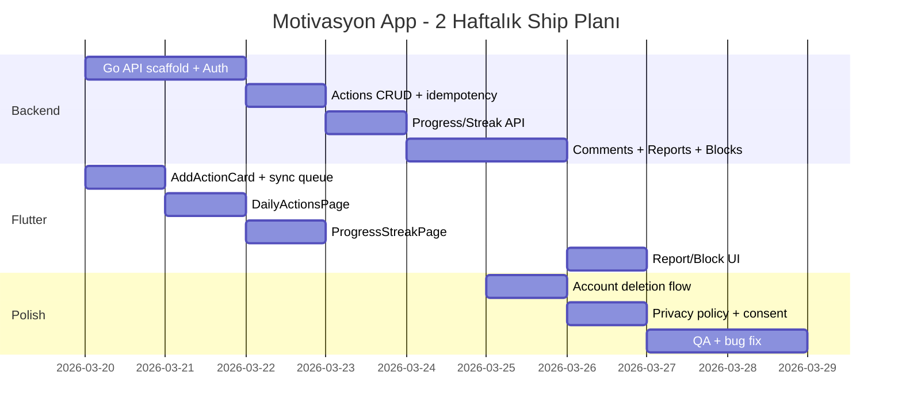
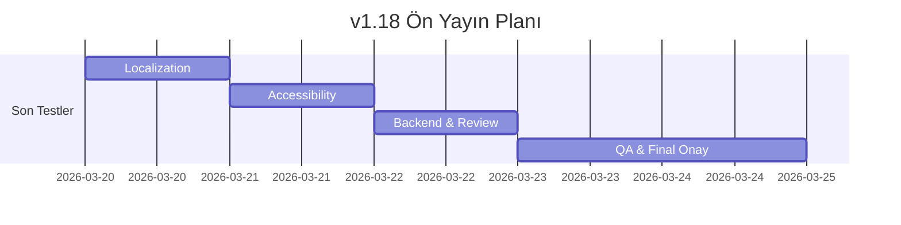

# Motivasyon Uygulaması – Apple 4.2 Uyumlu Tam Implementasyon Planı

**Belge Versiyonu:** 1.19  
**Tarih:** 2026-03-19  
**Hedef:** Guideline 4.2 (Minimum Functionality) reddini gidermek; aksiyon takibi, streak, progress UI ve UGC moderasyonu ile tam uygulama

---

## 1) Yönetici Özeti

### 4.2 Reddi ve Çözüm Kapsamı

Apple App Store [Guideline 4.2](https://developer.apple.com/app-store/review/guidelines/) uygulamaların “minimum functionality” sağlamasını gerektirir; “sadece web sitesi veya birkaç ekrandan ibaret” uygulamalar reddedilir. Mevcut uygulama: quote listesi + detay + yorum → bu yapı tek başına 4.2’de zayıf kalabilir.

**Bu planın kapsamı 4.2’yi nasıl çözer:**
- **Ana değer önerisi:** Quote sadece tetikleyicidir; uygulamanın core utility’si **günlük eylem/alışkanlık kaydı**’dır. Bu mesaj App Store açıklaması, "What's New" ve Review Notes’ta açıkça anlatılmalıdır.
- **Aksiyon takibi:** Kullanıcı quote ile ilişkili somut aksiyon kaydeder (“Bugün bu sözle ne yaptın?”) → etkileşim artar, sadece okuma değil “yapma” davranışı oluşur.
- **Streak/Progress:** Günlük alışkanlık döngüsü, seri takibi (current/best), son 7/30 gün görünümü → gamification ve uzun vadeli bağlılık gösterilir.
- **Günlük aksiyon listesi:** Kullanıcı kendi aktivitelerini yönetir → özgün, tekrarlanabilir değer.
- **UGC (yorumlar):** Zaten var; moderasyon eklenerek hem 4.2 hem de [Guideline 1.2](https://developer.apple.com/app-store/review/guidelines/#safety) (User Generated Content) riskleri azaltılır.
- **iPad uyumu:** Review cihazı iPad Air 11" olabildiği için ([App Review](https://developer.apple.com/distribute/app-review/)); progress ekranı ve günlük liste ekranında “tamamlanmış ürün hissi” vermeli, boş/basit görünmemelidir.

### UGC Riskleri ve Azaltma

| Risk | Önlem |
|------|--------|
| Zararlı/uygunsuz içerik | Report, block, temel filtreleme (bad words, link sayısı, tekrar eden metin, yeni hesap kısıtları), moderasyon akışı |
| 1.2 uyumu | "Timely responses" (Apple kesin süre belirtmez; operasyonel SLA hedefi tanımlanır), published contact info, kullanıcı engelleme |
| Spam/abuse | Rate limit, idempotency, block filtering, otomatik basic spam filtreleme |

---

## 2) Minimal Feature Set ve Kullanıcı Akışları

### 2.1 Kullanıcı Akışları (Metin Akışı)

```
[Ana Sayfa / Keşfet] 
    → Quote listesi (browse; login gerekmez)
    → Quote detay
        → Kaydet / Paylaş (opsiyonel login)
        → "Bugün bu sözle ne yaptın?" → Aksiyon ekle
            → Guest mode: login yok → lokal cache’e yaz; streak/progress lokal hesaplanır
            → Sync / yorum yazmak için → login istenir (5.1.1(v) "login’siz erişim" ruhu)
        → Yorumlar listesi (read: herkese açık)
        → Yorum yaz (login zorunlu)
    → Günlük Aksiyon Listesi (guest: lokal; login: sync’li)
    → Progress / Streak ekranı (guest: lokal hesaplama; login: server sync)
```

### 2.2 Guest Mode (5.1.1(v) + 4.2 Güçlendirmesi)

**Ürün kararı:** Core utility (aksiyon + streak/progress) login **olmadan** lokal modda çalışır. Bu yaklaşım:
- **5.1.1(v):** "Login’siz erişim" ruhunu güçlendirir; "significant account-based" sadece sync ve yorum.
- **4.2:** App, hesap olmadan da işe yarar → native utility algısı; reviewer demo account’suz da core flow’u görebilir.
- **Scope:** Lokal cache (aynı offline queue); streak/progress lokal hesaplama. Login yalnızca sync + yorum için zorunlu.

**Kritik implementasyon kararı — "Otomatik hesap" tuzağı (Apple account deletion rehberi):** Eğer uygulama guest için otomatik hesap oluşturuyorsa, bu hesaplar için de deletion opsiyonu gerekir.

| Tercih | Davranış | Apple etkisi |
|--------|----------|--------------|
| **Güvenli (önerilen)** | Guest Mode **tamamen lokal**; sunucuda `user` kaydı **açılmaz** | "Automatic account creation" kategorisine düşmez; deletion gereksinimi tetiklenmez. Lokal veriyi silme butonu UX için iyi olur. |
| **Riskli** | Guest'te arka planda server'da user/profil açılırsa | Apple bunu "automatic account" sayar → "delete guest account" beklentisi. |

**Belgede benimsenen:** **Güvenli tercih** — Guest Mode sunucuda hesap açmaz; tüm veri cihazda tutulur.

**Teknik gereksinim (kararın bozulmaması):**
- Guest Mode'da **ne Firebase anonymous account, ne Postgres `users` insert** yapılmayacak. Aksi durumda Apple "guest accounts da silinebilmeli" şartı devreye girer.
- **"Lokal veriyi sil"** butonu Apple zorunlu değil; fakat "hesap yoksa veriyi nasıl temizlerim?" beklentisini karşılar ve privacy algısını güçlendirir.

**Guest → Login geçişinde veri birleştirme (merge):** Login olunca mevcut lokal aksiyonların buluta taşınması **opt-in** olarak açıkça kullanıcıya anlatılmalı. Apple 5.1.1 manipülatif/trick consent istemez; akış "anlaşılır ve kullanıcı kontrolünde" olmalı.

**Opt-in UI metni örneği (review'da "gizli transfer yok" kanıtı):** Onay metni net ve **tek katılımlı** olmalı. Kullanıcı tek bir "Evet" veya "Hayır" butonu görecek; çok adımlı veya önceden işaretli kutularla gizli onam toplanmaz (Apple). Örn: *"Lokal aksiyonlarınızı buluta senkronize etmek ister misiniz?"* / *"Do you want to synchronize your local actions to the cloud?"* — Metin sade, doğrudan, yanıltıcı olmayan soru biçiminde; farklı dillere eksiksiz çevrilmeli ve her zaman gösterilmeli. **Erişilebilirlik:** Butonlar büyük; kontrast ≥4.5:1 ([WCAG 2.1](https://www.w3.org/WAI/WCAG21/quickref/#contrast-minimum)); Apple HIG benzer yüksek kontrast ve büyük dokunma hedefleri önerir. Apple, her UI öğesinin erişilebilir açıklaması olmasını şart koşar; VoiceOver için "Evet" ve "Hayır" butonlarına anlamlı etiketler eklenmeli. Tek satırlık soru; uzun cümlelerden kaçınılmalı. **UI zamanlaması:** Onay penceresi, kullanıcı söze dokunduğu anda otomatik açılmalı (Apple HIG: her UI öğesi kullanıcı eylemiyle direkt ilişkilendirilmelidir). Kullanıcı hangi öğeye tepki verdiğini anında görebilir.

### 2.3 Acceptance Criteria

| # | Özellik | AC |
|---|---------|-----|
| AC1 | Quote detayda "Aksiyon ekle" butonu | Guest: login yok → lokal cache’e yazar; sync isterse login’e yönlendirir |
| AC2 | Aksiyon ekleme | Guest: lokal cache + lokal streak; Login: backend sync; offline’da kuyruğa alınır |
| AC3 | Günlük aksiyon listesi | Bugünün aksiyonları listelenir; guest: lokal; login: sync’li; boş state anlamlı (iPad'de "boş ekran" hissi vermemeli). Öneri: bugünün quote'u + "Bugün bu sözle ne yaptın?" tek CTA |
| AC4 | Progress/Streak ekranı | Current streak (bugün yoksa: düne kadarki ardışık gün), best streak; son 7/30 gün grid/liste; **iPad'de "iki sayı + boş grid" görünmemeli** (4.2.2). Öneri: "İlk aksiyonunu ekle" CTA + örnek grid + "streak nasıl çalışır?" — **kural:** her zaman kullanıcıyı sonraki adıma teşvik eden öğe göster; boşluk varsa motive edici metin veya hızlı rehber |
| AC5 | Yorum yazma | Login zorunlu; report/block UI mevcut |
| AC6 | Report yorum | "Raporla" → reason seçimi → submit; anonim değil (user_id gerekli) |
| AC7 | Block kullanıcı | Engellenen kullanıcının yorumları gizlenir |
| AC8 | Hesap silme | Uygulama içinden kolay bulunur; tüm hesap + ilişkili veri (UGC dahil) silinir; işlem zaman alıyorsa kullanıcıya bildirilir; [Apple rehberi](https://developer.apple.com/support/offering-account-deletion-in-your-app/) |

---

## 3) Veri Modeli

### 3.1 Not: Mevcut Firebase vs Hedef Stack

**Belirsizlik:** Proje şu an Firebase (Firestore, Auth, Cloud Functions) kullanıyor. Planda **Go + Postgres** hedefleniyor. İki yol:
- **A)** Tam geçiş: Quotes Firestore’dan Postgres’e migrate; Go API tüm veriyi sunar.
- **B)** Hibrit: Firebase Auth (custom token → Go), quotes Firestore’da kalır veya sync; Actions/Comments/Streak/Reports → Go + Postgres.

Varsayım: **B hibrit** — kısa ship için Firebase Auth + Firestore (quotes read) korunur; yeni alanlar (actions, comments_moderated, streaks, reports, blocks) Go + Postgres’te tutulur. Migration notlarında tam geçiş de belirtilir.

### 3.2 Quote Kimliği Eşleştirmesi (Kritik)

**Sorun:** Client Firestore string id (`"abc123-firestore-id"`) gönderir; `actions.quote_id` Postgres FK ile UUID bekler. Bu çelişki implementasyonda kırılmaya yol açar.

**Çözüm (Seçenek A — önerilen):** Postgres’te `quotes` tablosu Firestore’u mirror eder; `external_id` = Firestore doc id. Client `quoteId` olarak string id gönderir; backend `quotes` tablosundan `external_id` ile arayıp `id` (UUID) alır, `actions.quote_id` FK’ya yazar. Referential integrity korunur; join’ler ve progress hesapları temiz kalır.

**Alternatif (Seçenek B):** `actions.quote_external_id` (string) tutup FK kaldırmak — hızlı ama referential integrity app koduna taşınır; uzun vadede risk.

Belgede **Seçenek A** benimsenir. API request body’deki `quoteId` = Firestore string id; response’ta da aynı döner (client tarafı değişmez).

### 3.3 Postgres Tablo Tasarımları

```sql
-- UUID extension
CREATE EXTENSION IF NOT EXISTS "pgcrypto";

-- Kullanıcılar (Firebase uid ile senkron, veya standalone)
CREATE TABLE users (
  id                UUID PRIMARY KEY DEFAULT gen_random_uuid(),
  firebase_uid      VARCHAR(128) UNIQUE,
  display_name      VARCHAR(100),
  email             VARCHAR(255),
  photo_url         TEXT,
  timezone          VARCHAR(64) DEFAULT 'Europe/Istanbul',
  created_at        TIMESTAMPTZ DEFAULT now(),
  updated_at        TIMESTAMPTZ DEFAULT now(),
  deleted_at        TIMESTAMPTZ,  -- soft delete, account deletion
  consent_analytics BOOLEAN DEFAULT false,
  consent_terms_at  TIMESTAMPTZ,
  consent_privacy_at TIMESTAMPTZ
);
CREATE INDEX idx_users_firebase_uid ON users(firebase_uid);
-- Aktif kullanıcı sorguları için (WHERE deleted_at IS NULL sık kullanılıyorsa)
CREATE INDEX idx_users_active ON users(deleted_at) WHERE deleted_at IS NULL;
-- Silinmiş hesapları audit/raporlama için aramak
CREATE INDEX idx_users_deleted_audit ON users(deleted_at) WHERE deleted_at IS NOT NULL;

-- Quotes (Firestore mirror; external_id = Firestore doc id)
CREATE TABLE quotes (
  id         UUID PRIMARY KEY DEFAULT gen_random_uuid(),
  external_id VARCHAR(64) UNIQUE NOT NULL,  -- Firestore doc id veya asset id
  title      TEXT NOT NULL,
  body       TEXT NOT NULL,
  image_url  TEXT,
  category   VARCHAR(64),
  order_num  INT,
  created_at TIMESTAMPTZ DEFAULT now()
);
CREATE INDEX idx_quotes_external_id ON quotes(external_id);

-- Aksiyonlar
CREATE TABLE actions (
  id              UUID PRIMARY KEY DEFAULT gen_random_uuid(),
  user_id         UUID NOT NULL REFERENCES users(id),
  quote_id        UUID NOT NULL REFERENCES quotes(id),  -- quotes.id (UUID); client quoteId (external_id) ile map edilir
  local_date      DATE NOT NULL,           -- kullanıcı timezone'da gün (YYYY-MM-DD)
  occurred_at_utc TIMESTAMPTZ,             -- aksiyonun gerçekleştiği an (RFC 3339); occurred_at ile local_date tutarlılık
  note            TEXT NOT NULL,
  idempotency_key VARCHAR(64),              -- Tek kaynak: Idempotency-Key header; body'de GÖNDERİLMEZ
  created_at      TIMESTAMPTZ DEFAULT now(),
  synced_at       TIMESTAMPTZ              -- client'tan sync zamanı (offline queue)
);
CREATE INDEX idx_actions_user_date ON actions(user_id, local_date DESC);
CREATE INDEX idx_actions_user_quote_date ON actions(user_id, quote_id, local_date);
-- Partial unique: sadece non-NULL idempotency_key'ler için; NULL'lar distinct, index verimli
CREATE UNIQUE INDEX idx_actions_idempotency ON actions(idempotency_key) WHERE idempotency_key IS NOT NULL;

-- User-day cache (streak hesaplama için)
CREATE TABLE user_day_cache (
  user_id    UUID NOT NULL REFERENCES users(id),
  local_date DATE NOT NULL,
  action_count INT NOT NULL DEFAULT 1,
  PRIMARY KEY (user_id, local_date)
);

-- Streak cache (performans)
CREATE TABLE streak_cache (
  user_id      UUID PRIMARY KEY REFERENCES users(id),
  current     INT NOT NULL DEFAULT 0,
  best        INT NOT NULL DEFAULT 0,
  last_date   DATE,          -- son aksiyon günü
  updated_at  TIMESTAMPTZ DEFAULT now()
);

-- Yorumlar (Postgres tarafı; Firestore'dan migrate veya dual-write)
CREATE TABLE comments (
  id          UUID PRIMARY KEY DEFAULT gen_random_uuid(),
  quote_id    UUID NOT NULL REFERENCES quotes(id),
  user_id     UUID NOT NULL REFERENCES users(id),
  text        TEXT NOT NULL,
  status      VARCHAR(20) DEFAULT 'visible',  -- visible, pending, hidden
  created_at  TIMESTAMPTZ DEFAULT now(),
  updated_at  TIMESTAMPTZ DEFAULT now()
);
CREATE INDEX idx_comments_quote ON comments(quote_id, created_at) WHERE status = 'visible';
CREATE INDEX idx_comments_user ON comments(user_id);

-- Report'lar
CREATE TABLE reports (
  id           UUID PRIMARY KEY DEFAULT gen_random_uuid(),
  comment_id   UUID NOT NULL REFERENCES comments(id),
  reporter_id  UUID NOT NULL REFERENCES users(id),
  reason       VARCHAR(50) NOT NULL,  -- spam, abuse, inappropriate, other
  details      TEXT,
  status       VARCHAR(20) DEFAULT 'pending',  -- pending, reviewed, dismissed
  created_at   TIMESTAMPTZ DEFAULT now()
);
CREATE INDEX idx_reports_status ON reports(status);
CREATE INDEX idx_reports_comment ON reports(comment_id);

-- Engellemeler
CREATE TABLE blocks (
  blocker_id  UUID NOT NULL REFERENCES users(id),
  blocked_id  UUID NOT NULL REFERENCES users(id),
  created_at  TIMESTAMPTZ DEFAULT now(),
  PRIMARY KEY (blocker_id, blocked_id)
);
CREATE INDEX idx_blocks_blocked ON blocks(blocked_id);

-- Moderasyon audit
CREATE TABLE moderation_audit (
  id          UUID PRIMARY KEY DEFAULT gen_random_uuid(),
  entity_type VARCHAR(32) NOT NULL,  -- comment, user, report
  entity_id   UUID NOT NULL,
  action      VARCHAR(32) NOT NULL,  -- hide, unhide, block, unblock, dismiss
  actor_id    UUID REFERENCES users(id),
  note        TEXT,
  created_at  TIMESTAMPTZ DEFAULT now()
);
CREATE INDEX idx_mod_audit_entity ON moderation_audit(entity_type, entity_id);

-- Privacy/consent flags (users tablosunda da var; ayrı tablo opsiyonel)
-- consent_analytics, consent_terms_at, consent_privacy_at → users
```

### 3.4 Örnek JSON Payload’ları

**Action Create Request:** (`quoteId` = Firestore external_id; backend `quotes` tablosundan UUID'ye map eder). Header: `Idempotency-Key: <uuid>` (tek kaynak; body'de `idempotencyKey` **yok**).
```json
{
  "quoteId": "abc123-firestore-id",
  "localDate": "2026-03-19",
  "note": "Bu sözle bugün sabah meditasyon yaptım."
}
```

**Action Create Response (201):** (timestamp RFC 3339)
```json
{
  "id": "550e8400-e29b-41d4-a716-446655440000",
  "quoteId": "abc123-firestore-id",
  "localDate": "2026-03-19",
  "note": "Bu sözle bugün sabah meditasyon yaptım.",
  "createdAt": "2026-03-19T10:30:00Z"
}
```

**Progress Response:**
```json
{
  "currentStreak": 5,
  "bestStreak": 12,
  "lastActionDate": "2026-03-19",
  "last7Days": [
    { "date": "2026-03-13", "count": 1 },
    { "date": "2026-03-14", "count": 2 },
    { "date": "2026-03-15", "count": 0 },
    { "date": "2026-03-16", "count": 1 },
    { "date": "2026-03-17", "count": 1 },
    { "date": "2026-03-18", "count": 1 },
    { "date": "2026-03-19", "count": 1 }
  ],
  "last30Days": [ "... benzer format" ]
}
```

**Comment Create:**
```json
{ "text": "Çok güzel bir söz, teşekkürler!" }
```

**Report Create:**
```json
{
  "commentId": "uuid",
  "reason": "inappropriate",
  "details": "opsiyonel ek bilgi"
}
```

---

## 4) Streak / Progress Hesap Kuralları

### 4.1 Gün Tanımı

- **local_date:** Kullanıcının `timezone`’una göre aksiyonun yapıldığı **yerel takvim günü** (YYYY-MM-DD).
- [RFC 3339](https://datatracker.ietf.org/doc/html/rfc3339) timestamp backend’te tutulur; `created_at` → kullanıcı timezone’unda `local_date`’e map edilir.

### 4.2 Timezone Handling

| Senaryo | Kural |
|---------|-------|
| Aksiyon ekleme | Client, cihaz timezone’unu `X-Timezone: Europe/Istanbul` header’ında gönderir; server bu timezone ile `local_date` hesaplar veya client `localDate` gönderir (client authoritative). |
| Gece yarısı | Aksiyon 23:59’da eklendi → o gün sayılır. 00:01’de eklendi → yeni gün. |
| Timezone değişimi | Kullanıcı seyahat ederse: `timezone` güncellenir; mevcut `local_date` değerleri değişmez (geçmiş veri tutarlı kalır). |

**Varsayım:** `local_date` client’ta hesaplanıp gönderilir; server doğrulama yapar (geçmiş max 7 gün, gelecek 0 gün). Timestamp formatı [RFC 3339](https://datatracker.ietf.org/doc/html/rfc3339) profilinde taşınmalıdır.

### 4.3 "Current Streak" Tanımı (AC’ye Eklenecek)

| Bugün aksiyon var mı? | Current streak gösterimi |
|----------------------|---------------------------|
| Evet | Bugüne kadar olan ardışık gün sayısı |
| Hayır | "Düne kadar" ardışık gün sayısı; veya 0 (eğer dün de yoksa) |

**Acceptance criteria’ya ek:** UX kararı netleştirilmeli; test senaryoları buna göre yazılır. Öneri: Bugün yoksa = düne kadarki streak (yani "current" henüz tamamlanmamış günü saymaz).

### 4.4 Kaçırılan Gün

- **Streak:** Ardışık günlerde en az 1 aksiyon varsa streak devam eder. Bir gün atlanırsa streak sıfırlanır.
- **Missed day:** Geçmiş gün için retroaktif aksiyon eklenebilir (örn. son 7 gün); bu gün streak’e dahil edilir.

### 4.5 Birden Çok Aksiyon / Gün

- Aynı günde birden fazla aksiyon: **streak için 1 gün = 1 sayım**. Yani o gün “yapıldı” kabul edilir, sayı fark etmez.
- Progress grid’de: `count` = o gündeki aksiyon sayısı (opsiyonel; en az 1 ise “dolu” gösterilebilir).

### 4.6 Retroaktif Düzenleme / Silme

| Aksiyon | Etki |
|---------|------|
| Geçmiş güne aksiyon ekleme | Streak yeniden hesaplanır; ardışıklık bozulmuyorsa streak artabilir. |
| Aksiyon silme | O günde başka aksiyon yoksa streak kırılır; `user_day_cache` ve `streak_cache` invalidate edilir. |
| Aksiyon düzenleme (local_date değişimi) | Eski gün çıkar, yeni gün eklenir; streak yeniden hesaplanır. |

### 4.7 Timezone Değişimi

- Geçmiş aksiyonların `local_date`’i değişmez.
- Yeni aksiyonlar güncel `timezone` ile hesaplanır.
- Streak hesabı `local_date` sıralamasına göre yapılır (timezone’a bağlı değil, tutarlı).

---

## 5) API Tasarımı

### 5.1 Endpoint Tablosu

| Method | Path | Auth | Rate Limit | Amaç |
|--------|------|------|------------|------|
| GET | /v1/quotes | Optional | 60/min | Quote listesi (Firestore’dan da okunabilir; Go mirror) |
| GET | /v1/quotes/:id | Optional | 60/min | Quote detay |
| POST | /v1/actions | Required | 30/min | Aksiyon ekle (idempotency key header) |
| GET | /v1/actions/daily | Required | 60/min | Günlük aksiyon listesi (?date=YYYY-MM-DD) |
| GET | /v1/progress | Required | 60/min | Streak + son 7/30 gün |
| GET | /v1/comments | Optional | 60/min | Yorum listesi (?quoteId=) |
| POST | /v1/comments | Required | 10/min | Yorum yaz |
| POST | /v1/reports | Required | 5/min | Yorum/icerik raporla |
| POST | /v1/blocks | Required | 10/min | Kullanıcı engelle |
| DELETE | /v1/blocks/:userId | Required | 10/min | Engeli kaldır |
| POST | /v1/auth/token | Public | 10/min | Firebase ID token → JWT exchange |
| POST | /v1/auth/refresh | Public | 20/min | Refresh token → yeni JWT |
| DELETE | /v1/account | Required | 5/min | Hesap silme |

### 5.2 Auth Önerisi

- **JWT ([RFC 7519](https://datatracker.ietf.org/doc/html/rfc7519))** — claim taşıyan kompakt token formatı.
- **Bearer ([RFC 6750](https://datatracker.ietf.org/doc/html/rfc6750))** — HTTP isteklerinde `Authorization: Bearer <token>` kullanım modeli.
- Firebase ID token → Go backend doğrular → custom JWT + refresh token döner.
- **JWT claim’leri:** `user_id` (veya `sub`), `roles` (opsiyonel), `consent_flags` (opsiyonel).
- Access token: 15 dk; refresh: 7 gün; refresh token rotasyonu (UGC spam azaltma için önerilir).
- **Sign in with Apple + silme:** Apple token revocation için [Apple REST API](https://developer.apple.com/documentation/sign_in_with_apple/revoking_tokens) kullanılır. Firebase Auth ile Apple provider kullanıldığında, Firebase Apple token’ları saklamadığı için revocation aşamasında kullanıcıdan yeniden sign-in istenebilir. Review Notes’ta gerektiğinde açıklanmalıdır.

### 5.3 Rate Limiting: 429 + Retry-After

[HTTP 429](https://developer.mozilla.org/en-US/docs/Web/HTTP/Reference/Status/429) dönüldüğünde:
```
HTTP/1.1 429 Too Many Requests
Retry-After: 60
Content-Type: application/json
{"error": "rate_limit_exceeded", "retryAfter": 60}
```

### 5.4 Idempotency Davranışı

| Durum | Yanıt |
|-------|--------|
| Aynı key + aynı payload (retry) | İlk yanıtı aynen dön (201 + ilk response body) — client retry’ları kolaylaştırır |
| Aynı key + farklı payload | 409 Conflict |

### 5.5 Request/Response Örnekleri

**POST /v1/actions**
```
Headers:
  Authorization: Bearer <jwt>
  Idempotency-Key: <uuid>
  Content-Type: application/json

Body: { "quoteId": "...", "localDate": "YYYY-MM-DD", "note": "..." }  (idempotencyKey body'de YOK)
Response 201: { "id": "...", "quoteId": "...", "localDate": "...", "note": "...", "createdAt": "..." }
Response 409: Aynı key ile farklı payload
```

**GET /v1/progress**
```
Headers: Authorization: Bearer <jwt>
Query: ?timezone=Europe/Istanbul (opsiyonel)

Response 200: { "currentStreak": 5, "bestStreak": 12, "last7Days": [...], "last30Days": [...] }
```

**POST /v1/reports**
```
Body: { "commentId": "uuid", "reason": "spam|abuse|inappropriate|other", "details": "..." }
Response 201: { "id": "...", "status": "pending" }
```

---

## 6) Flutter UI

### 6.1 ASCII Wireframe’ler

```
┌─────────────────────────────────────┐
│  [<-]  Quote Detay            [⋮]   │
├─────────────────────────────────────┤
│  ┌─────────────────────────────┐   │
│  │     [Görsel / Image]        │   │
│  └─────────────────────────────┘   │
│  "Title"                           │
│  Body metni... Lorem ipsum...      │
│                                    │
│  [Kaydet] [Paylaş]                 │
│                                    │
│  ┌─────────────────────────────┐   │
│  │ Bugün bu sözle ne yaptın?   │   │
│  │ [_____________________]     │   │
│  │ [Aksiyon Ekle]              │   │
│  └─────────────────────────────┘   │
│                                    │
│  --- Yorumlar (12) ---             │
│  ┌─────────────────────────────┐   │
│  │ 👤 Ali: Güzel söz! [Raporla] │   │
│  │ 👤 Ayşe: Teşekkürler         │   │
│  └─────────────────────────────┘   │
│  [Yorum yaz...        ] [Gönder]   │
└─────────────────────────────────────┘

┌─────────────────────────────────────┐
│  Günlük Aksiyonlar                  │
├─────────────────────────────────────┤
│  19 Mart 2026                       │
│  ┌─────────────────────────────┐   │
│  │ • "Söz X" - Meditasyon yaptım│   │
│  │ • "Söz Y" - Journal yazdım  │   │
│  └─────────────────────────────┘   │
│  (boşsa: "Bugün henüz aksiyon yok") │
└─────────────────────────────────────┘

┌─────────────────────────────────────┐
│  Progress & Streak                  │
├─────────────────────────────────────┤
│  🔥 Current: 5 gün                  │
│  🏆 Best: 12 gün                    │
│                                    │
│  Son 7 gün:                        │
│  [✓][✓][○][✓][✓][✓][✓]             │
│  13  14  15  16  17  18  19        │
│                                    │
│  Son 30 gün: (grid veya liste)     │
└─────────────────────────────────────┘
```

### 6.2 Screen / Widget Listesi

| Tip | İsim | Açıklama |
|-----|------|----------|
| Screen | `ContentDetailPage` | Mevcut; aksiyon ekleme bölümü eklenir |
| Screen | `DailyActionsPage` | Yeni; günlük aksiyon listesi |
| Screen | `ProgressStreakPage` | Yeni; streak + 7/30 gün; iPad’de tam ürün hissi |
| Screen | `SupportContactPage` | Destek/İletişim (1.2 published contact) |
| Screen | `LinkedAccountsPage` | Bağlı hesaplar / Giriş yöntemleri (5.1.1(v) credential revoke) |
| Widget | `AddActionCard` | Quote detayda "Bugün ne yaptın?" kartı |
| Widget | `ActionListTile` | Tek aksiyon satırı |
| Widget | `StreakSummaryCard` | Current / Best streak kartı |
| Widget | `DayGrid` | 7/30 gün grid |
| Widget | `CommentTile` | Yorum satırı + Raporla/Engelle |
| Dialog | `ReportReasonSheet` | Rapor nedeni seçimi |

### 6.3 State Management Önerisi

[Flutter resmi rehberi](https://docs.flutter.dev/data-and-backend/state-mgmt/options): Uygulama karmaşıklığına göre seçenekler önerir. **Riverpod** (veya Provider) tercih edilir:
- Auth durumu, offline queue, sync durumu merkezi yönetilir.
- `AsyncNotifier` ile actions/progress/streak state’leri yönetilir.
- Offline: `sqlite` veya `drift` + sync queue; veya basit JSON dosyası (path_provider) ile pending actions tutulup, network geldiğinde `ActionSyncService` ile batch gönderilir.
- Networking: [http paketi](https://pub.dev/packages/http); JSON: [serialization rehberi](https://docs.flutter.dev/development/data-and-backend/json).

### 6.4 Kod Snippet’leri

**Aksiyon Ekleme (offline-first kuyruk):** Idempotency-Key header’da gönderilir; body’de yok.
```dart
// ActionSyncService - basitleştirilmiş
class ActionSyncService {
  static Future<void> enqueueAndSync(ActionDto dto) async {
    final prefs = await SharedPreferences.getInstance();
    final pending = jsonDecode(prefs.getString('pending_actions') ?? '[]') as List;
    final key = const Uuid().v4();
    pending.add({...dto.toJson(), 'idempotencyKey': key});  // local queue; server'a header'da gönderilir
    await prefs.setString('pending_actions', jsonEncode(pending));
    await _processQueue();
  }
  static Future<void> _processQueue() async {
    // network check, POST /v1/actions with header Idempotency-Key: key, body without idempotencyKey
    // remove from pending on success
  }
}
```

**Lokal streak hesap (offline fallback):**
```dart
int computeLocalStreak(List<Action> actions) {
  if (actions.isEmpty) return 0;
  final dates = actions.map((a) => a.localDate).toSet().toList()..sort();
  var streak = 0;
  var prev = dates.last;
  for (var i = dates.length - 1; i >= 0; i--) {
    final d = dates[i];
    if (_dayDiff(prev, d) == 1) streak++;
    else if (i == dates.length - 1) streak = 1;
    else break;
    prev = d;
  }
  return streak;
}
```

---

## 7) Go Backend

### 7.1 Modeller ve Katmanlar

```
handlers/     → HTTP handler (auth middleware, validation)
services/     → Business logic (action, comment, report, block, streak)
repositories/ → DB access (Postgres)
models/       → Struct definitions
middleware/   → auth, ratelimit, idempotency
```

### 7.2 Transaction Akışı (Aksiyon Ekleme)

Go [sql.Tx](https://pkg.go.dev/database/sql#Tx) ile commit/rollback modeli ([resmi doküman](https://go.dev/doc/database/execute-transactions)); streak cache ile action yazma aynı tx içinde — tutarsızlık önlenir.

```
1. Auth middleware: JWT → user_id
2. Idempotency check: Idempotency-Key header → DB'de var mı? Aynı payload → 200 + ilk yanıt; farklı → 409
3. quoteId (external_id) → quotes.id (UUID) map
4. Insert action (user_id, quote_id, local_date, occurred_at_utc, note)
5. Upsert user_day_cache (user_id, local_date)
6. Recompute streak_cache (current, best)
7. Commit transaction
```

### 7.3 Moderasyon Workflow (Apple 1.2’nin Dört Şartı DB’de İzlenebilir)

| 1.2 şartı | DB/ürün karşılığı |
|-----------|-------------------|
| Filtering objectionable material | `comments.status` (visible/pending/hidden); block filtering; basic spam: link sayısı limiti, tekrar eden metin, yeni hesap kısıtları |
| Content reporting + timely response | `reports` tablosu + `moderation_audit` log; operasyonel SLA hedefi (Apple kesin süre vermez) |
| Block abusive users | `blocks` PK |
| Published contact info | Uygulama içi "Destek/İletişim" ekranı; App Store Support URL ile uyumlu |

```
comment create → status: visible (default)
                → basic filter (bad words, link count, repeat text, new-account limit) → pending

report create  → report.status: pending
                → report count(comment) >= 3 → comment.status: hidden (auto)
                → moderation_audit log

admin queue    → GET /admin/reports (pending) → review
                → POST /admin/comments/:id/hide | unhide
                → block filtering: comments list'te blocked users exclude
```

### 7.4 Örnek SQL Schema (Migration)

```sql
-- Migration 001_init.up.sql (özet)
CREATE EXTENSION IF NOT EXISTS "pgcrypto";
-- ... (yukarıdaki CREATE TABLE'lar)

-- Migration 002_comments_indexes
CREATE INDEX CONCURRENTLY IF NOT EXISTS idx_comments_quote_status 
  ON comments(quote_id, created_at) WHERE status = 'visible';
```

---

## 8) Güvenlik, Gizlilik ve App Store Uyum Checklist

### 8.1 Guideline Kontrol Listesi

| Guideline | Gereksinim | Durum |
|-----------|------------|-------|
| [4.2](https://developer.apple.com/app-store/review/guidelines/#minimum-functionality) | Minimum işlevsellik | Aksiyon, streak, progress, UGC ile karşılanır |
| [1.2](https://developer.apple.com/app-store/review/guidelines/#user-generated-content) | UGC: (1) filtering (2) report+timely response (3) block (4) published contact | Filter + report + block + Destek/İletişim ekranı |
| [4.8](https://developer.apple.com/app-store/review/guidelines/#sign-in-with-apple) | Üçüncü parti login varsa eşdeğer seçenek | Uygulamada 3rd party login varsa 4.8’in eşdeğer login şartlarını karşılayacak Apple login seçeneği sunulur (canonically Sign in with Apple) |
| [5.1.1](https://developer.apple.com/app-store/review/guidelines/#privacy) | Privacy policy, login zorunluluğu, credential/data revoke | [5.1.1(i)] Policy link App Store + uygulama içi; [5.1.1(v)] Browse + guest mode (aksiyon/streak lokal) login’siz; sync/yorum login zorunlu; **credential revoke:** Profil → Bağlı hesaplar (Google unlink, Apple revoke) |
| [Account deletion](https://developer.apple.com/support/offering-account-deletion-in-your-app/) | Hesap silme | Kolay bulunur; tüm hesap + ilişkili veri (UGC dahil); web’e yönlendirme varsa direkt link; işlem zaman alıyorsa kullanıcıya bildirilir |

### 8.2 Sosyal Login Credential Revoke (5.1.1(v))

Apple 5.1.1(v): Sosyal ağ ile ilişkili credential ve data access’in **uygulama içinden revoke edilebilmesi** gereklidir.

**Profil/Ayarlar altında "Bağlı hesaplar" veya "Giriş yöntemleri" ekranı:**
- "Google bağlantısını kes" — Firebase `unlink`; kullanıcı Google credential’ını uygulama ile paylaşmayı kaldırır.
- "Apple bağlantısını kes" — Stop Using Apple ID yönlendirmesi + app-level revoke; gerektiğinde [Apple Revoking Tokens](https://developer.apple.com/documentation/sign_in_with_apple/revoking_tokens) API kullanımı.
- "Veri erişimini kapat" — açıklama: uygulamanın sosyal provider’dan ne topladığını ve nasıl kesileceğini anlatır.

**Üçlü kapsam:** unlink + sign out + data access disable birlikte olmalı.

**Firebase unlink uyarısı:** Provider unlink edildikten sonra aynı provider ile tekrar giriş yapılırsa Firebase **yeni/ayrı bir hesap** oluşturabilir. Bu davranışı kullanıcıya (help tooltip veya açıklama metni) göstermek destek taleplerini azaltır.

**Re-sign-in için önerilen UI metni** (Settings + Account Deletion akışında): *"Hesabınızı silme talebinizi doğrulamak ve Apple oturum izinlerini iptal etmek için yeniden giriş gerekebilir."*

**Apple Sign in:** Kullanıcılar [Stop using Sign in with Apple](https://support.apple.com/HT210426) ile sistem ayarlarından ilişkiyi kesebilir; destek ekranında bu bağlantı gösterilmeli.

Bu ekran, hesap silmeden **bağımsız** olarak credential/data revoke sağlar.

### 8.3 UGC: Report / Block / Published Contact

- **Published contact information:** Uygulama içinde ayrı "Destek/İletişim" ekranı; App Store metadata’daki Support URL ile uyumlu; **kolay bulunur**; App Store Support URL ile çakışmamalı. Kırık link review'da sık sorundur.
- Report sonrası "Şikayetiniz alındı" mesajı.
- **"Timely responses":** Apple kesin süre belirtmez; operasyonel SLA hedefi tanımlanır. "Apple 24 saat istiyor" şeklinde yazılmamalı.

### 8.4 Hesap Silme ve UGC (Apple Rehberi)

- **Silme talebinde:** UGC (yorumlar vb.) **derhal görünmez** yapılır (örn. `comments.status = hidden`); kullanıcıya "Silme işlemi tamamlanana kadar içerikleriniz görünmez" mesajı verilir.
- **Yasal retention:** Yasal sebeple tutulması gereken veri varsa, **privacy policy’de istisna açıkça anlatılır**.

### 8.5 App Store Connect Support URL Uyumu

App Store Connect Support URL: kullanıcıların ulaşabileceği gerçek iletişim bilgilerine (e-posta/telefon) yönlendirmeli. Uygulamadaki Destek ekranı aynı hedefe yönlendirmeli. **Tercih:** Uygulama içi sayfada doğrudan e-posta veya iletişim formu kullanmak; her iki yerde de iletişim kanalı olmalı. 1.2 "published contact" sadece "Support URL var" ile karşılanmaz; uygulama içinde kolay erişim zorunludur.

### 8.6 Review'a Hazır Son Kontrol

**Demo credential:** Guest Mode güçlü olsa bile, login gerektiren yorum/sync için demo hesap eksiksiz doldurulmalı. Apple: talimat/demo girilmezse review gecikebilir. **Link hijyeni:** Support + Privacy linkleri çalışır olmalı.

---

## 9) Test & QA

### 9.1 Unit / Integration Test Örnekleri

| Senaryo | Beklenen |
|---------|----------|
| Streak: ardışık 5 gün aksiyon | current=5, best≥5 |
| Streak: 1 gün atlandı | current=0 |
| Streak: retroaktif dün ekleme | streak güncellenir |
| Idempotency: aynı key + aynı payload 2. POST | 200 + ilk response (replay); aynı key + farklı payload → 409 |
| Offline aksiyon + sync | Kuyrukta kalır → online → sync → listede görünür |
| Block: engellenen kullanıcı yorumu | Listede görünmez |

### 9.2 Manuel QA Checklist

- [ ] iPhone SE, iPhone 15; **iPad Air 11"** (review cihazı)
- [ ] **Guest mode:** Login olmadan aksiyon ekle → günlük liste + streak görünüyor mu?
- [ ] Offline: aksiyon ekle → uçak modu → sync → online → sync tamamlandı mı?
- [ ] Login: Apple, Google; Sign in with Apple iOS’ta çalışıyor mu?
- [ ] Bağlı hesaplar: Google/Apple disconnect çalışıyor mu?
- [ ] Hesap silme: Akış tamamlanıyor mu? UGC hemen gizleniyor mu?
- [ ] Report: Rapor gönderildi mi? (Test backend)
- [ ] Privacy policy: Uygulama içi link çalışıyor mu?

### 9.3 Review Öncesi Son Test (4.2/1.2 Kırık Çıkma Riski Minimum)

- [ ] **Demo hesabı ile:** Yorum ekleme + aksiyon sync
- [ ] **Guest Mode → hesap bağlama:** Senkronizasyon opt-in akışı çalışıyor mu? Veri akışı **yalnızca onay sonrası** başlıyor mu? "Hayır" seçilince veri gerçekten telefonda kalıyor mu?
- [ ] **"Bize Ulaşın" linki:** Tıklanınca destek sayfasına gidiyor mu?
- [ ] **Boşluk senaryoları:** Daily list ve Progress boşken UI talimat veriyor mu? (CTA, motive edici metin)

### 9.4 Final Validation (App Review Öncesi Zorunlu)

v1.7 ile 4.2/1.2/5.1.1 itiraz noktaları kapatılmış; aşağıdakiler **gönderim öncesi** doğrulanmalı:

| Kontrol | Açıklama |
|---------|----------|
| **Tüm diller testi** | Onay metninin her dilde doğru göründüğünü onaylayın (lokalizasyon) |
| **Senaryo testleri** | 9.3 maddelerini eksiksiz geçin (Evet/Hayır akışı, veri lokalde kalma) |
| **Link kontrolü** | "Bize Ulaşın" ve "Destek" bağlantılarını açın; çalıştıklarından emin olun |

Bu talimatlar ve testler geçildikten sonra App Review Notes'a 11.2'deki anahtar ifade kopyalanmalıdır.

### 9.5 Detaylı 10 Adımlı Test Tablosu

| # | Adım | Açıklama | Cihaz | Beklenen Durum |
|---|------|----------|-------|----------------|
| 1 | Çeviri kontrolü | Onay, hata, düğme metinlerinin seçili dillerde doğru çevrildiğini kontrol et | iPhone/iPad | Tüm metinlerin doğru ve tutarlı olduğunu onaylayın |
| 2 | Onay akışı (Evet) | Guest'ta "Evet" deyip giriş yap; veri buluta transfer edilmeli mi? | iPhone/iPad | Giriş sonrası sadece onaydan sonra senkronizasyon başlar |
| 3 | Onay akışı (Hayır) | Guest'ta "Hayır" deyip geç; uygulama normal devam ediyor mu? | iPhone/iPad | Veriler telefonda kalıcı; sunucuya veri gönderilmemeli; sonraki açılışta kullanılabilir |
| 4 | Yorum ekleme | Oturum açıldıktan sonra quote için yorum yaz | iPhone/iPad | Yorum görünmeli; Raporla ve Block seçenekleri aktif |
| 5 | Aksiyon senkron | Offline aksiyon ekle, sonra online yap | iPhone/iPad | İnternet geldiğinde offline eklenen aksiyon sunucuya yansıtılsın; aynı idempotencyKey ile ikinci kayıt yapılmamalı; duplicate oluşmamalı |
| 6 | Boş ekran CTA/metin | iPad'de boş durum ekranı | iPhone 14, iPad | Kullanıcı boş ekranda yönlendirilmiş olmalı; motive edici mesaj veya simge gösterilsin |
| 7 | Offline senaryoları | Uçak modu açıkken aksiyon ekle; bağlantı sağlanınca | iPhone/iPad | Bağlantı sağlanınca otomatik senkronizasyon gerçekleşmeli |
| 8 | Ağ kesintisi | Ağ gidip gelse bile | iPhone/iPad | Uygulama kararlı kalmalı; kullanıcıya uygun hata mesajı veya otomatik tekrar imkânı verilmeli. Veri gönderimi sırasında hata mesajı veya retry mekanizması çalışmalı |
| 9 | Apple kimlik bağlantısını kesme | Ayarlar→Sign in with Apple'dan uygulamayı seçip "Stop Using" dedikten sonra | iPhone 14 | Kullanıcı çıkış yapmalı |
| 10 | Destek linkleri | "Bize Ulaşın" ve Ayarlar→Destek sayfalarındaki bağlantılar | iPhone/iPad | Bağlantılar doğru şekilde açılmalı |

**Kritik:** Adım 5, 6 ve 8 uygulamanın bütünlüğü ve kullanılabilirliği açısından önemlidir. Apple "tüm akışlarının sorunsuz çalışmasını" bekler. Bu adımlar başarıyla geçilmelidir.

### 9.6 Risk Analizi ve Azaltma

| Risk | Tür | Azaltma Önlemi |
|------|-----|----------------|
| Guest→Sunucu veri uyuşmazlığı | Teknik | Onay olmadan sunucuya veri gönderme. Önlem: Go tarafında consent kontrolü ile sadece "Evet" sonrası INSERT; `local_date` timestamp (RFC 3339); idempotent işle |
| Firebase unlink sonrası hesap karmaşası | İşlevsel | Unlink sonrası aynı yöntemle tekrar giriş = farklı UID. Önlem: `linkWithCredential` ile eski hesapla yeniden ilişkilendirme veya kullanıcıyı bilgilendir (Firebase: unlink sonrası aynı provider ile tekrar girişte yeni kullanıcı oluşur) |
| Sign in with Apple re-auth | İşlemsel | Apple REST API: refresh token yoksa POST /auth/revoke kullanılır. Uygulama içi uyar; re-auth adımını açıkça belirt |
| Lokalizasyon eksikliği | Kullanıcı | Metinler uzman çeviri ekibi tarafından bir kez daha son kez kontrol edildi. Hataları iyice inceleyin ve düzeltilmiş olduğuna emin olun |
| Privacy/Support eksikliği | Yasal | "Bize Ulaşın" ile App Store destek bağlantıları (Support URL) tutarlı olmalı. Gizlilik politikasını ve iletişim kanallarını test edin. Her iki ortamda da iletişim bilgileri erişilebilir olmalıdır |
| Yazılım hataları | Teknik | fmt.Errorf ile loglama beklenmedik kapanmaları engeller. Uygulama hatayı yakalayıp kullanıcıya ileti verecek şekilde çalışır; stabilite korunur |

### 9.7 Gönderim Öncesi Son Kontrol Listesi

Aşağıdakilerin her biri geçerliyse uygulamayı yayınlayabilirsiniz:

- [ ] Lokalizasyon: Son çeviriler onaylandı mı?
- [ ] Diyalog Zamanlaması: Dokunur dokunmaz açılıyor mu?
- [ ] Idempotency: Aynı anahtarla duplicate kayıt yok mu?
- [ ] Review Notes: Talimatlar güncel mi?
- [ ] Linkler: "Bize Ulaşın" ve destek URL'leri tutarlı ve çalışıyor mu?
- [ ] Demo Hesap: Hesap bilgileriyle testler başarıyla geçildi mi?
- [ ] Hata Yönetimi: fmt.Errorf ile loglama düzgün mü?

**Risk–Mitigasyon tablosu** (tüm maddeler uzman ekip tarafından onaylanmalı; 4.2/1.2/5.1.1 uyumu):

| Risk | Mitigasyon Önerisi |
|------|-------------------|
| Lokalizasyon hatası | Uzman çeviri ekibi ile son kontroller |
| Destek/Gizlilik açığı | "Bize Ulaşın" ve App Store Support URL tutarlı; gizlilik politikası test edildi |
| Diğer yazılım hatası | fmt.Errorf ile hata loglama; uygulama istikrarını korur |

---

## 10) Zaman Çizelgesi ve Efor

### 10.1 Mermaid Gantt



### 10.2 Yayın Öncesi Son Hazırlık (v1.18 Gantt)



### 10.3 Görev Bazlı Tahmini

| Görev | Saat | Öncelik |
|-------|------|---------|
| Go API + Postgres setup | 8 | P0 |
| Actions API + idempotency | 4 | P0 |
| Streak hesaplama + cache | 6 | P0 |
| Flutter AddActionCard + offline queue | 6 | P0 |
| DailyActionsPage | 3 | P0 |
| ProgressStreakPage | 4 | P0 |
| Comments API (Go) + Firestore migrasyon | 6 | P0 |
| Report + Block API + UI | 6 | P0 |
| Account deletion | 4 | P0 |
| Guest mode (lokal aksiyon/streak) | 4 | P0 |
| Bağlı hesaplar (credential revoke) | 3 | P1 |
| Privacy policy + consent UI | 2 | P1 |
| QA + bug fix | 8 | P1 |
| **Toplam** | ~57 saat | |

### 10.4 Kritik Yol ve Sonraya Bırakılabilecekler

**Kritik yol:** Guest mode (lokal aksiyon/streak) → Auth → Actions → Streak → UI (AddAction + Daily + Progress) → Comments/Report/Block → Account deletion + Bağlı hesaplar → QA

**Sonraya bırakılabilir:** 30 gün detaylı grid, admin panel (manuel DB ile başlangıç), analytics opt-in gelişmiş UI.

---

## 11) App Store Connect Metinleri

### 11.1 App Review Reply Şablonu

```
Dear App Review Team,

Thank you for your feedback regarding Guideline 4.2 (Minimum Functionality).

We have significantly expanded the app. The core value proposition is daily action/habit tracking — quotes are the trigger; the main utility is recording and viewing what users did with each quote.

1. Action tracking + Guest mode: Users can add actions and view daily list + streak/progress **without login** (local storage). Login required only for sync and comments.
2. Progress & Streak: Current streak, best streak, and last 7/30 days view; works locally for guests.
3. User-generated content (comments) with full moderation: Report, block, filtering, and published contact (Support screen) per Guideline 1.2.
4. Account deletion: In-app, easy to find; covers all account and UGC; UGC hidden immediately on delete request; user informed if processing takes time.
5. Credential revoke (5.1.1(v)): Profile > Linked Accounts — disconnect Google/Apple and revoke data access.

Per 5.1.1(v): Core utility (actions, streak) works without login. We offer Sign in with Apple alongside Google Sign-In (4.8 compliance).

We have included a demo account and step-by-step test instructions in the Review Notes.

Best regards,
[Your name]
```

### 11.2 Review Notes (Adım Adım Test Talimatı)

```
TEST INSTRUCTIONS FOR APP REVIEW

Login (5.1.1(v)): Core features (add action, daily list, streak/progress) work WITHOUT login (guest mode, local data). Use demo account only for sync and comments.

1. Browse quotes: Open app → Explore tab → Tap any quote. (No login)
2. Add action (guest mode): On quote detail, tap "Bugün bu sözle ne yaptın?" → Enter "Meditation" → Tap "Aksiyon Ekle". Works without login; actions and streak stored locally.
3. Daily actions: Profile tab → "Günlük Aksiyonlar" → See today's actions.
4. Progress/Streak: Profile tab → "Progress & Streak" → View current streak and 7-day grid. (iPad layout tested)
5. Comments: On quote detail, scroll to comments. Add comment (requires login). Use "Raporla" to report inappropriate content.
6. Support/Contact (1.2): Profile or Settings → "Destek / İletişim" — published contact info for UGC reports.
7. Linked Accounts (5.1.1(v)): Profile → "Bağlı hesaplar" — disconnect Google/Apple, revoke data access.
8. Account deletion: Profile → Account → Delete Account → Confirm. Covers all account and UGC data; UGC hidden immediately on request.

DEMO ACCOUNT (login gerektiren akışlar için — comments, sync — mutlaka doldurulmalı; Apple review gecikmemesi):
Email: review@yourdomain.com
Password: DemoReview2025!
2FA: Disabled for review, or provide app-specific password.

ÖZET (Review Notes'a kopyalanacak anahtar ifade — App Review ekibine verilecek):
"Uygulamamızın ana işlevleri hesap gerektirmeden çalışır. Hesap gerektiren yorum ve aksiyon senkronizasyonu işlevleri için [testhesap@ornek.com / Şifre] bilgilerini kullanarak giriş yapabilirsiniz. Uygulama içindeki 'Bize Ulaşın' ekranı ile Ayarlar → Destek bölümü aktif ve test edilebilir durumdadır."

NOT: Sign in with Apple ile hesap silme sırasında, Firebase token saklamadığı için revocation için re-sign-in istenebilir; bu beklenen davranıştır.
```

### 11.3 Review Notes — Türkçe Adım Adım Talimat (Reviewer'a Kopyalanacak)

```
TEST TALİMATLARI:
1. Uygulamayı açın; giriş gerekmiyor. Rastgele bir söze dokunun.
2. Diyaloğa "Evet" diyerek giriş yapın (DEMO HESAP: [testhesap@ornek.com / DemoPass2026!]).
3. "Bugün bu sözle ne yaptın?" sorusuna bir aksiyon girin; Profil→Günlük Aksiyonlar'da listelendiğini görün.
4. Başka bir söze yorum yazın; yorum görünsün ve "Raporla" ile "Engelle" seçeneklerinin çalıştığını doğrulayın.
5. Uygulamayı kapatıp yeniden açın, ardından oturumu kapatın. Sonra "Hayır" deyin ve yeni bir aksiyon ekleyin. Uygulamayı açınca önceki aksiyonların kaybolmadığını kontrol edin.
6. Uçak moduna geçin, bir aksiyon ekleyin; online konumda senkronizasyonun gerçekleştiğini görün.
7. Ayarlar→Destek altında "Bize Ulaşın" butonuna dokunun; destek iletişim bilgileri açılmalı.
```

### 11.4 Demo Account Format

```
Email: [obfuscated or test account]
Password: [strong test password]
2FA: Disabled for review, or provide app-specific password
```

### 11.5 Örnek Kod: Opt-in Diyaloğu ve Backend Kontrolü

**Flutter — Onay diyaloğu (callback ile):**
```dart
void showSyncDialog(BuildContext context, Function(bool) onDecision) {
  showDialog(
    context: context,
    builder: (_) => AlertDialog(
      title: Text('Aksiyon Senkronizasyonu'),
      content: Text('Lokal aksiyonlarınızı buluta senkronize etmek ister misiniz?'),
      actions: [
        TextButton(onPressed: () => onDecision(false), child: Text('Hayır')),
        ElevatedButton(onPressed: () => onDecision(true), child: Text('Evet')),
      ],
    ),
  );
}
// Çağıran: onDecision sonrası Navigator.pop(context) ile diyaloğu kapatır
```

**Go — Opt-in kontrolü (consent kontrolü ile güvenli veri ekleme):**
```go
func SyncActions(userID uuid.UUID, consent bool, actions []Action) error {
  if !consent {
    log.Info("Sync declined by user; no actions sent")
    return nil
  }
  for _, a := range actions {
    _, err := db.Exec(`INSERT INTO actions (user_id, quote_id, note) VALUES ($1,$2,$3)`, userID, a.QuoteID, a.Note)
    if err != nil {
      return fmt.Errorf("DB insert error: %w", err)
    }
  }
  return nil
}
// fmt.Errorf ile loglama, uygulamanın çökmesini önler. Hata durumunda kullanıcıya uygun mesaj veya geri bildirim sağlanır. Apple uygulama stabilitesi beklentisi.
```

---

## 12) Citations (Kaynaklar)

| Kaynak | URL |
|--------|-----|
| App Store Review Guidelines (4.2, 1.2, 4.8, 5.1.1) | https://developer.apple.com/app-store/review/guidelines/ |
| Account deletion requirement | https://developer.apple.com/support/offering-account-deletion-in-your-app/ |
| App Review / demo account / Before You Submit | https://developer.apple.com/distribute/app-review/ |
| Sign in with Apple – Revoking tokens | https://developer.apple.com/documentation/sign_in_with_apple/revoking_tokens |
| Stop using Sign in with Apple (iOS ayarları) | https://support.apple.com/HT210426 |
| RFC 7519 (JWT) | https://datatracker.ietf.org/doc/html/rfc7519 |
| RFC 6750 (Bearer tokens) | https://datatracker.ietf.org/doc/html/rfc6750 |
| RFC 3339 (timestamps) | https://datatracker.ietf.org/doc/html/rfc3339 |
| RFC 6749 (OAuth 2.0) | https://datatracker.ietf.org/doc/html/rfc6749 |
| RFC 8259 (JSON) | https://datatracker.ietf.org/doc/html/rfc8259 |
| WCAG 2.1 (contrast) | https://www.w3.org/WAI/WCAG21/quickref/#contrast-minimum |
| HTTP 429 + Retry-After | https://developer.mozilla.org/en-US/docs/Web/HTTP/Reference/Status/429 |
| Go database/sql Tx | https://pkg.go.dev/database/sql#Tx |
| Flutter state management | https://docs.flutter.dev/data-and-backend/state-mgmt/options |

---

## 13) Belirsizlikler & Varsayımlar

### Belirsizlikler

| # | Belirsizlik | Etki |
|---|-------------|------|
| FLAG-1 | Proje Firebase kullanıyor; plan Go+Postgres istiyor. Tam geçiş mi, hibrit mi? | Hibrit varsayıldı; migration eforu değişebilir |
| FLAG-2 | Quotes kaynağı: Firestore’da kalacak mı, Postgres’e migrate edilecek mi? | Firestore read korundu; quote_id external id ile eşleşir |
| FLAG-3 | Admin panel ihtiyacı: Sadece DB/script ile mi, yoksa basit web arayüz mü? | Manuel DB ile başlangıç varsayıldı |
| FLAG-4 | FCM / widget: Go backend’ten tetiklenecek mi, yoksa Cloud Functions aynen mi? | Mevcut Functions korunur varsayıldı |

### Varsayımlar

| # | Varsayım | Plan Etkisi |
|---|----------|-------------|
| V1 | Firebase Auth kalacak; Go backend Firebase ID token doğrular, custom JWT üretir | Auth katmanı hybrid; Apple/Google SDK’lar değişmez |
| V2 | `local_date` client-authoritative; server sadece doğrulama yapar (geçmiş max 7 gün, gelecek 0) | Streak hesaplama basitleşir |
| V3 | Report threshold: 3 report → auto-hide | Otomatik moderasyon; admin override gerekebilir |
| V4 | Hesap silme: soft delete (`deleted_at`); 30 gün sonra hard delete (cron); UGC dahil tüm ilişkili veri silinir | Apple: hesap + ilişkili veri (UGC) silme beklentisi; uygulama içinden "silindi" hissi |
| V5 | Solo dev, 1–2 hafta: Admin panel yok; moderasyon SQL veya script ile | Operational efor kabul edildi |
| V6 | Guest Mode sunucuda hesap **açmaz**; tüm veri cihazda tutulur | Apple "otomatik guest account → deletion gerekir" maddesinden muaf kalınır |

---

## 14) Revizyon Geçmişi

**v1.19 — 2026-03-19** (v1.18 PDF nihai düzenlemeler ve yayına hazırlık analizi sonrası)
- **Erişilebilirlik:** "Her UI öğesi kullanıcı eylemiyle direkt ilişkilendirilmeli"; hangi öğeye tepki verdiğini anında görebilir; Apple "hiç beklenmedik şekilde çökmesin".
- **10 adımlı test:** Adım 5 "İnternet geldiğinde"; Adım 6 "yönlendirilmiş olmalı; motive edici mesaj veya simge"; Adım 8 "ağ gidip gelse bile"; "veri gönderimi sırasında retry mekanizması"; Kritik: "Bu adımlar başarıyla geçilmelidir".
- **Risk:** L10n "düzeltilmiş olduğuna emin olun"; Destek "her iki ortamda iletişim bilgileri erişilebilir"; Yazılım "hatayı yakalayıp kullanıcıya ileti verecek şekilde".
- **9.7:** "Son çeviriler"; "duplicate kayıt yok mu"; "Talimatlar güncel mi"; "testler başarıyla geçildi mi"; "loglama düzgün mü"; "onaylanmalı".
- **Review Notes:** Adım 4 "yorum görünsün".
- **Gantt:** v1.18 Ön Yayın Planı.
- **Go:** "çökmesini önler"; "Apple uygulama stabilitesi beklentisi".

**v1.18 — 2026-03-19** (v1.17 PDF son değerlendirme analizi sonrası)
- **Erişilebilirlik:** "Dokunur dokunmaz açılma"; Apple HIG UI eylemiyle direkt ilişkilendirilmeli; kararlı çalışma.
- **10 adımlı test:** Adım 1 "doğru ve tutarlı onaylayın"; Adım 5 "bağlantı sağlandığında yansıtılsın"; Adım 6 "ne yapacağını anlatan metin veya simge"; Adım 8 "kararlı kalmalı; hata mesajı veya otomatik tekrar"; Kritik: 5, 6, 8.
- **Risk:** L10n "bir kez daha son kez"; "iyice inceleyin"; Destek "gizlilik politikası ve iletişim kanallarını test edin"; "doğrulanmalı; 4.2/1.2/5.1.1".
- **9.7:** Kontrol listesi "Review Notes doğru mu"; "Linkler tutarlı ve çalışıyor mu"; "loglama sağlandı mı".
- **Review Notes:** Adım 4 "Başka bir söze"; Adım 6 "online konumda".
- **Gantt:** v1.17 Ön Yayın Planı.
- **Go:** "çökmemesini sağlar"; "stabilite sağlanır".

**v1.17 — 2026-03-19** (v1.16 PDF nihai düzenlemeler analizi sonrası)
- **Erişilebilirlik:** "Dokunduğu anda otomatik"; stabil hata iletimi (çökme yerine hatayı yakalayarak).
- **10 adımlı test:** Adım 1 "doğru ve tutarlı"; Adım 5 "offline eklenen internet gelince"; Adım 6 "ne yapacağına dair mesaj veya ikon"; Adım 7 "otomatik senkronizasyon"; Adım 8 "uygun geri bildirim (hata mesajı veya retry)"; Kritik: 5, 6, 8.
- **Risk:** L10n "bir kez daha kontrol"; "iyice elimine edin"; Destek "mağaza iletişim kanalları tutarlı"; Yazılım "loglayarak mesaj döndürmelidir".
- **9.7:** Kontrol listesi 7 madde (Erişilebilirlik çıkarıldı); "onaylanmalı"; Teslimat Kontrol Listesi.
- **Review Notes:** Adım 5 "Hayır deyin"; Gantt "Backend & Review".
- **Go:** "çökmeden devam eder"; "kullanıcıya uygun mesaj/geri bildirim".

**v1.16 — 2026-03-19** (v1.15 PDF son noktalar analizi sonrası)
- **Erişilebilirlik:** "Dokunduğu anda otomatik"; Apple HIG bağlam duyarlı; kullanıcı hangi öğeyle etkileşime geçtiğini net görür.
- **10 adımlı test:** Adım 5 "Internet geldiğinde"; Adım 6 "yönlendirici metin veya simge"; Adım 8 "kararlı kalmalı"; Adım 9 "Stop Using dedikten sonra"; Kritik: 6 ve 8 kullanıcı deneyimi.
- **Risk:** L10n "uzman çeviri ekibi son kez kontrol"; Destek "tutarlı"; Yazılım "loglayıp mesaj döndürerek stabil".
- **9.7:** Kontrol listesi sadeleştirildi; Risk–Mitigasyon "uzman ekip tarafından doğrulanmalı".
- **Review Notes:** Adım 2 "Diyaloğa"; Adım 4 "Farklı bir söze"; Adım 6 "online konumda".
- **Gantt:** v1.15 Ön Yayın Planı.

**v1.15 — 2026-03-19** (v1.14 PDF final değerlendirme analizi sonrası)
- **Erişilebilirlik:** "Dokunduğu anda otomatik açılmalı"; Apple HIG bağlama duyarlı; fmt.Errorf ile stabil hata iletimi.
- **10 adımlı test:** Adım 5/6/8 güncellendi; "Kritik" notu (idempotency, boş ekran, çökmeden devam).
- **Risk:** L10n "uzman ekiple son kontrolleri"; Yazılım hataları riski eklendi.
- **9.7:** "Diyalog Zamanlaması: Dokunur dokunmaz"; "Aynı anahtarla duplicate".
- **Review Notes:** Adım 4 "yorumun göründüğünü"; Adım 5 "Ardından"; Adım 6 "senkronizasyonun gerçekleştiğini görün".
- **Gantt:** v1.14; Backend & Review Notları.

**v1.14 — 2026-03-19** (v1.13 PDF final düzenlemeler analizi sonrası)
- **Erişilebilirlik:** "Dokunur dokunmaz"; Apple HIG "kontekste uygun UI".
- **10 adımlı test:** Adım 5 idempotencyKey aynı iken ikinci kayıt yok; Adım 6 boş ekranlarda CTA; Adım 8 hatasız kalmalı; Adım 9/10 netleştirildi.
- **Risk:** L10n "kontrollü çeviri süreci"; Privacy "Gizlilik politikası test edin"; 1.2 hem uygulama içi hem store destek.
- **9.7:** Risk–Mitigasyon tablosu eklendi; kontrol listesi sadeleştirildi.
- **Review Notes:** Adım 4 "Başka bir söze"; Adım 5 "kapatıp yeniden açın".
- **Gantt:** v1.13 Ön Yayın Planı; section Son Testler.

**v1.13 — 2026-03-19** (v1.12 PDF son düzenlemeler analizi sonrası)
- **9.7:** Gönderim öncesi 8 maddelik son kontrol listesi.
- **Erişilebilirlik:** "Bağlama duyarlı"; diyalog sözün bağlamını tanımlamalı.
- **Test tablosu:** Adım 5 idempotency "aynı anahtar iki kez gönderilmemeli"; Adım 9 "Stop Using" netleştirildi.
- **Risk:** L10n "kontrollü çeviri"; Privacy "Bize Ulaşın + Support URL".
- **Review Notes:** Adım 3 "listelendiğini görün"; Adım 4 "Engelle" eklendi; Adım 7 "destek iletişim bilgileri".
- **Gantt:** v1.12 Ön Yayın Planı; after loc/acc bağımlılıkları.
- **Go:** Panik yerine hata dönüşü; Apple 4.0 stabilite.

**v1.12 — 2026-03-19** (v1.11 PDF son düzenlemeler analizi sonrası)
- **Erişilebilirlik:** Apple her UI öğesinin erişilebilir açıklaması; "hemen sonra" diyalog; kontekst tabanlı UI.
- **10.2:** Yayın öncesi Gantt (Localization, Erişilebilirlik, Go+RN, QA).
- **Test tablosu:** Adım 5 idempotency key + arabellek vurgusu.
- **Risk:** L10n "tam karşılık"; Privacy/Support "yeniden kontrol".
- **Review Notes:** "Gelen diyaloğa"; "Destek altında"; adım 5/7 sadeleştirildi.

**v1.11 — 2026-03-19** (v1.10 PDF yayına hazırlık analizi sonrası)
- **Erişilebilirlik:** WCAG 2.1 referansı; UI zamanlaması (söze dokunduktan sonra diyalog).
- **Risk:** Go consent kontrolü vurgusu; Apple POST /auth/revoke.
- **Go kod:** fmt.Errorf ile error handling.
- **Citations:** RFC 6749, RFC 8259, WCAG 2.1.
- **Review Notes:** Demo hesap adım 2'de; adımlar sadeleştirildi.

**v1.10 — 2026-03-19** (v1.9 PDF analizi sonrası)
- **Erişilebilirlik:** Kontrast ≥4.5:1; tek satırlık soru.
- **Firebase unlink:** `linkWithCredential` ile yeniden ilişkilendirme önerisi.
- **Review Notes Türkçe:** 7 adım yeniden sıralandı (offline testi eklendi); demo hesap ayrı satır.
- **Kod:** Flutter `onDecision` callback; Go INSERT syntax.

**v1.9 — 2026-03-19** (PDF derinlemesine analiz sonrası)
- **9.5:** 10 adımlı detaylı test tablosu (çeviri, Evet/Hayır, yorum, offline, network, Sign in with Apple, link).
- **9.6:** Risk analizi ve azaltma tablosu (veri uyuşmazlığı, Firebase unlink, re-auth, L10n, privacy).
- **11.3:** Türkçe adım adım Review Notes talimatı.
- **11.5:** Flutter/Go opt-in örnek kodu.
- **Opt-in metin:** İngilizce örnek + erişilebilirlik notu.

**v1.8 — 2026-03-19** (v1.7 uyum analizi sonrası)
- **9.4 Final Validation:** Tüm diller; senaryo testleri; link kontrolü. Gönderim öncesi zorunlu.
- **Review Notes:** "test edilebilir durumdadır" ifadesi.

**v1.7 — 2026-03-19** (v1.6 uyum analizi sonrası)
- **Opt-in UI:** Tek "Evet/Hayır" butonu; çok adımlı/önceden işaretli kutu yok; multi-language + her zaman göster.
- **Review Notes:** "Uygulamamızın..." formunda, yorum ve aksiyon senkronizasyonu vurgulu anahtar ifade.
- **9.3 Son test:** "Hayır" seçilince veri telefonda kalıyor mu kontrolü.

**v1.6 — 2026-03-19** (v1.5 uyum analizi sonrası)
- **Opt-in UI metni:** Örnek onay cümlesi; review'da "gizli transfer yok" kanıtı.
- **Empty-state kuralı:** Her zaman sonraki adıma teşvik eden öğe; motive edici metin/rehber.
- **Support:** Uygulama içi doğrudan e-posta/form tercihi.
- **Review Notes şablonu:** Anahtar ifade (kopyalanacak özet).
- **9.3 Son test:** Demo+sync, Guest→sync, Bize Ulaşın linki, boşluk senaryoları.

**v1.5 — 2026-03-19** (v1.4 uyum analizi sonrası)
- **Guest → login merge:** Lokal veri buluta taşınması **opt-in**; anlaşılır ve kullanıcı kontrolünde (5.1.1 manipülatif consent yok).
- **Empty-state tasarım:** Progress: "İlk aksiyonunu ekle" CTA + örnek grid + "streak nasıl çalışır?"; Daily: bugünün quote'u + tek CTA.
- **Support URL:** App Store Connect = uygulama içi kanallar; 1.2 "Support URL var" ile geçiştirilemez.
- **Review'a hazır:** 8.5–8.6 bölümleri; demo credential eksiksiz doldurma vurgusu.

**v1.4 — 2026-03-19** (v1.3 derinlemesine uyum incelemesi sonrası)
- **Guest Mode teknik gereksinim:** Firebase anonymous + Postgres users insert yapılmayacak; "lokal veriyi sil" butonu önerisi.
- **LinkedAccountsPage:** Firebase unlink sonrası "yeni ayrı hesap" uyarısı; re-sign-in için önerilen UI metni.
- **UGC published contact:** Kolay bulunur; App Store Support URL ile çakışmamalı.
- **iPad empty-state (4.2.2):** Progress/streak ve daily list "boş grid" görünmemeli; empty-state tasarımına özel dikkat.

**v1.3 — 2026-03-19** (ChatGPT Apple uyum değerlendirmesi sonrası)
- **Guest Mode "otomatik hesap" tuzağı:** Güvenli tercih netleştirildi — sunucuda hesap AÇILMAZ; riskli tercih (server user) tanımlandı.
- **LinkedAccountsPage kapsamı:** unlink + sign out + data access disable üçlüsü; Apple "Stop using Sign in with Apple" linki (destek ekranında).
- **Firebase + Apple revocation:** Re-auth gerekebilir notu doküman ve Review Notes'a eklendi.
- **Demo account:** "Mutlaka doldurulmalı" vurgusu (review gecikmemesi).
- **V6 varsayımı:** Guest Mode sunucuda hesap açmaz.

**v1.2 — 2026-03-19** (ChatGPT incelemesi sonrası ek düzeltmeler)
- **Guest mode:** Core utility (aksiyon, streak, progress) login olmadan lokal modda çalışır; login sadece sync + yorum için zorunlu (5.1.1(v) + 4.2 güçlendirmesi).
- **Sosyal login credential revoke (5.1.1(v)):** Profil → "Bağlı hesaplar" ekranı; Google unlink, Apple revoke, veri erişimini kapat açıklaması.
- **Hesap silme + UGC:** Silme talebinde UGC derhal hidden; kullanıcıya bilgi; yasal retention istisnası privacy policy’de.
- **Kırık link uyarısı:** Support/Privacy linkleri review’da sorun çıkarmamalı.

**v1.1 — 2026-03-19**
- **Tarih:** 2025 → 2026 düzeltmesi ( review/metadata tutarlılığı )
- **Login opsiyonel:** Apple 5.1.1(v) "significant account-based features" ile bağlandı
- **UGC "timely responses":** Kesin süre ifadesi kaldırıldı; operasyonel SLA hedefi tanımı
- **Quote kimliği:** Firestore string id ↔ Postgres UUID eşleştirmesi (Seçenek A) netleştirildi
- **Account deletion:** Apple rehberine sıkı bağlandı; UGC dahil ilişkili veri; işlem süresi bildirimi
- **1.2 dört şart:** Filtering (block + basic spam), published contact (Destek/İletişim ekranı)
- **4.8:** "3rd party login varsa eşdeğer seçenek" ifadesi
- **Idempotency:** Tek kaynak = header; replay (aynı key+payload) → 200 + ilk yanıt; conflict → 409
- **JWT/Auth:** RFC 7519/6750, claim’ler, refresh rotasyonu, Sign in with Apple revocation notu
- **Streak:** "Current streak" tanımı (bugün yoksa) AC’ye eklendi; server doğrulama (max 7 gün geçmiş)
- **Index’ler:** `idx_users_deleted` → `idx_users_active` + `idx_users_deleted_audit`; partial unique idempotency
- **actions:** `occurred_at_utc` eklendi
- **App Review metinleri:** 5.1.1(v), 1.2 contact, Sign in with Apple revocation; iPad layout vurgusu

---

*Bu belge tek kaynak olarak kullanılabilir; proje detayları güncellendiğinde revize edilmelidir.*
